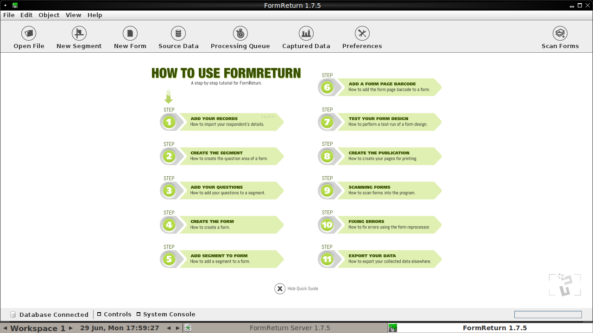

# FormReturn 1.7.5 en contenedor (Docker)

[FormReturn](https://github.com/rquast/formreturn) es una aplicación de
**reconocimiento óptico de marcas (OMR)** para procesar formularios y exámenes
escaneados. Esta es una aplicación Java Swing pensada para JDK 8; este repositorio
la empaqueta en un contenedor con **OpenJDK 8** para poder ejecutarla en sistemas
modernos sin tocar el JDK del sistema.

La imagen descarga el instalador oficial precompilado (release `v1.7.5`) y extrae
únicamente `lib/` (la app + sus ~60 dependencias). **No compila nada**, así que no
depende de `maven.formreturn.com` ni del paso de instalación interactivo.



> FormReturn Manager 1.7.5 corriendo dentro del contenedor (modo VNC web,
> visto desde el navegador).

## Dos modos de ejecución

El repositorio ofrece dos formas de mostrar la interfaz gráfica:

| Modo | Imagen | Acceso | Cuándo usarlo |
|------|--------|--------|---------------|
| **X11 / XWayland** | `formreturn:1.7.5` | Ventana nativa en tu escritorio Linux | Linux con servidor X o XWayland |
| **VNC web (noVNC)** | `formreturn:1.7.5-vnc` | Navegador en `http://localhost:6080/vnc.html` | Cualquier SO, servidores headless, acceso remoto |

## Archivos

| Archivo | Descripción |
|---------|-------------|
| `Dockerfile` | Modo X11: `eclipse-temurin:8-jdk` + libs X11 nativas + extracción de `lib/`, corre como usuario `ubuntu` (uid 1000) |
| `entrypoint.sh` | Arranca `java -jar lib/formreturn.jar` mostrando la GUI en el `DISPLAY` del host |
| `run.sh` | Wrapper del host para el modo X11: autoriza `xhost`, fija `DISPLAY` y monta volúmenes |
| `Dockerfile.vnc` | Modo VNC: añade Xvfb + Fluxbox + x11vnc + websockify + noVNC para servir la GUI por navegador |
| `entrypoint-vnc.sh` | Lanza el stack VNC (X virtual, window manager, servidor VNC, websockify) y luego FormReturn |
| `run-vnc.sh` | Wrapper del host para el modo VNC: construye la imagen, publica el puerto 6080 y monta volúmenes |
| `formreturn_server.sh` | Script del componente servidor que el Manager lanza vía `ProcessBuilder` |

---

## Modo X11 / XWayland

### Construir

```bash
docker build -t formreturn:1.7.5 .
```

> La imagen reusa el usuario `ubuntu` (uid/gid 1000) que ya trae
> `eclipse-temurin:8-jdk`, igual que el uid por defecto del host. Así los archivos
> en `~/.formreturn` son tuyos y no de root. Si tu uid no es 1000, revisa la nota
> de *ownership* más abajo.

### Ejecutar

```bash
./run.sh
```

`run.sh` se encarga de:

- Crear `~/.formreturn` para persistir los datos.
- Autorizar el acceso a tu pantalla con `xhost +SI:localuser:$(whoami)`.
- Montar `/tmp/.X11-unix` (solo lectura) y el volumen de datos.
- Lanzar el contenedor con `DISPLAY=:1` por defecto.

Los datos (BD Derby, formularios, capturas) persisten en `~/.formreturn`, como una
instalación nativa, y son propiedad de tu usuario.

Para revocar el acceso a la pantalla al terminar:

```bash
xhost -SI:localuser:$(whoami)
```

---

## Modo VNC web (noVNC)

Útil en servidores sin escritorio o para acceso remoto: la GUI se renderiza en un
servidor X virtual (Xvfb) y se sirve por navegador con noVNC.

### Construir y ejecutar

```bash
./run-vnc.sh
```

`run-vnc.sh` construye la imagen `formreturn:1.7.5-vnc` (con `Dockerfile.vnc`),
publica el puerto y arranca el contenedor. Luego abre en tu navegador:

```
http://localhost:6080/vnc.html
```

Para cambiar el puerto:

```bash
NOVNC_PORT=8080 ./run-vnc.sh   # http://localhost:8080/vnc.html
```

### Compartir archivos con el contenedor

El modo VNC monta `~/FormReturnUploads` del host en `/home/ubuntu/Uploads` dentro
del contenedor (con un acceso directo **«Archivos para subir»** en el escritorio
de Fluxbox). Coloca ahí las imágenes escaneadas para importarlas desde FormReturn.

### Navegador web (enlaces de ayuda)

FormReturn abre páginas de ayuda/tutoriales en un navegador externo. La imagen VNC
incluye **Firefox** (instalado desde el repositorio oficial de Mozilla) para que
esos enlaces funcionen; sin él, FormReturn mostraba *«Could not find web browser»*.
Firefox viene preconfigurado vía `autoconfig` para abrir la URL directamente, sin
el modal de *Terms of Use* ni el asistente de primer arranque.

---

## Memoria

Por defecto la JVM usa `-Xmx1024m`. Para formularios o imágenes grandes:

```bash
JAVA_MEM=2048 ./run.sh
# o
JAVA_MEM=2048 ./run-vnc.sh
```

## Detalles de renderizado

Ambos modos aplican dos *workarounds* necesarios para Swing bajo XWayland/Xvfb:

- `-Dsun.java2d.xrender=false`: sin esto, la aceleración XRender pinta las
  ventanas en blanco.
- `XLIB_SKIP_ARGB_VISUALS=1` (modo X11): fuerza visuals RGB de 24 bits porque
  XWayland no pinta el visual ARGB de 32 bits que Java solicita.

## Notas

- **SELinux (openSUSE / Fedora)**: si tienes SELinux en *enforcing*, `run.sh` usa
  `--security-opt label=disable` para poder leer `/tmp/.X11-unix`. No se usa
  `:z`/`:Z` en ese socket porque reetiquetaría el X del host y rompería tu sesión.
- **Ownership**: el contenedor corre como `ubuntu` con uid 1000. Si tu `id -u` es
  distinto, los archivos en `~/.formreturn` podrían quedar con otro propietario.
- **Escáner**: FormReturn soporta SANE (`swingsane`), pero el escaneo directo desde
  el contenedor requeriría `libsane` y mapear el dispositivo (no incluido). La
  alternativa es escanear fuera e importar las imágenes.
- **Persistencia**: ambos `run*.sh` montan `$HOME/.formreturn` →
  `/home/ubuntu/.formreturn`, así que la base de datos y los proyectos sobreviven
  entre ejecuciones aunque el contenedor se cree con `--rm`.

## Versión

La versión de FormReturn se controla con el build-arg `FORMRETURN_VERSION`
(por defecto `1.7.5`):

```bash
docker build --build-arg FORMRETURN_VERSION=1.7.5 -t formreturn:1.7.5 .
```
